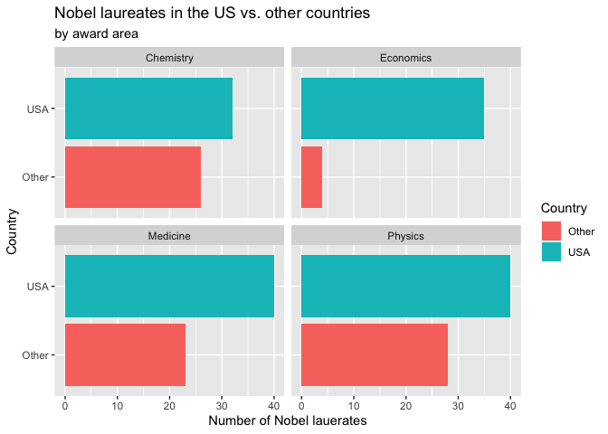
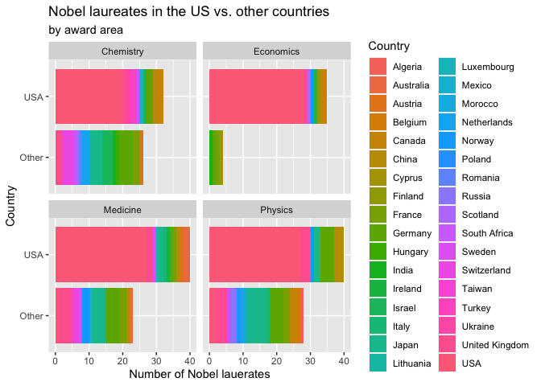
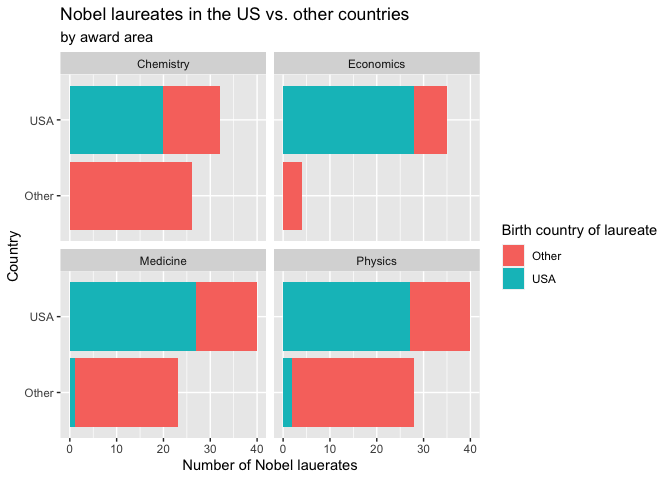

Lab 03 - Nobel laureates
================
Rowan Kemmerly
1.31.22

### Load packages and data

``` r
library(tidyverse) 
```

``` r
nobel <- read_csv("data/nobel.csv")
```

## Exercises

### Exercise 1

#### How many observations and how many variables are in the dataset? Use inline code to answer this question. What does each row represent?

``` r
glimpse(nobel)
```

    ## Rows: 935
    ## Columns: 26
    ## $ id                    <dbl> 1, 2, 3, 4, 5, 6, 6, 8, 9, 10, 11, 12, 13, 14, 1…
    ## $ firstname             <chr> "Wilhelm Conrad", "Hendrik A.", "Pieter", "Henri…
    ## $ surname               <chr> "Röntgen", "Lorentz", "Zeeman", "Becquerel", "Cu…
    ## $ year                  <dbl> 1901, 1902, 1902, 1903, 1903, 1903, 1911, 1904, …
    ## $ category              <chr> "Physics", "Physics", "Physics", "Physics", "Phy…
    ## $ affiliation           <chr> "Munich University", "Leiden University", "Amste…
    ## $ city                  <chr> "Munich", "Leiden", "Amsterdam", "Paris", "Paris…
    ## $ country               <chr> "Germany", "Netherlands", "Netherlands", "France…
    ## $ born_date             <date> 1845-03-27, 1853-07-18, 1865-05-25, 1852-12-15,…
    ## $ died_date             <date> 1923-02-10, 1928-02-04, 1943-10-09, 1908-08-25,…
    ## $ gender                <chr> "male", "male", "male", "male", "male", "female"…
    ## $ born_city             <chr> "Remscheid", "Arnhem", "Zonnemaire", "Paris", "P…
    ## $ born_country          <chr> "Germany", "Netherlands", "Netherlands", "France…
    ## $ born_country_code     <chr> "DE", "NL", "NL", "FR", "FR", "PL", "PL", "GB", …
    ## $ died_city             <chr> "Munich", NA, "Amsterdam", NA, "Paris", "Sallanc…
    ## $ died_country          <chr> "Germany", "Netherlands", "Netherlands", "France…
    ## $ died_country_code     <chr> "DE", "NL", "NL", "FR", "FR", "FR", "FR", "GB", …
    ## $ overall_motivation    <chr> NA, NA, NA, NA, NA, NA, NA, NA, NA, NA, NA, NA, …
    ## $ share                 <dbl> 1, 2, 2, 2, 4, 4, 1, 1, 1, 1, 1, 1, 2, 2, 1, 1, …
    ## $ motivation            <chr> "\"in recognition of the extraordinary services …
    ## $ born_country_original <chr> "Prussia (now Germany)", "the Netherlands", "the…
    ## $ born_city_original    <chr> "Lennep (now Remscheid)", "Arnhem", "Zonnemaire"…
    ## $ died_country_original <chr> "Germany", "the Netherlands", "the Netherlands",…
    ## $ died_city_original    <chr> "Munich", NA, "Amsterdam", NA, "Paris", "Sallanc…
    ## $ city_original         <chr> "Munich", "Leiden", "Amsterdam", "Paris", "Paris…
    ## $ country_original      <chr> "Germany", "the Netherlands", "the Netherlands",…

There are 26 columns and 26 corresponding variables, and each of the 935
rows represents an individual Nobel laureate.

### Exercise 2

Now I’m creating the data frame for only currently alive Nobel
laureates.

``` r
nobel_living <- filter(nobel, !is.na(country), gender != "org", is.na(died_date))
```

``` r
glimpse(nobel_living)
```

    ## Rows: 228
    ## Columns: 26
    ## $ id                    <dbl> 68, 69, 95, 97, 98, 99, 101, 103, 106, 107, 111,…
    ## $ firstname             <chr> "Chen Ning", "Tsung-Dao", "Leon N.", "Leo", "Iva…
    ## $ surname               <chr> "Yang", "Lee", "Cooper", "Esaki", "Giaever", "Jo…
    ## $ year                  <dbl> 1957, 1957, 1972, 1973, 1973, 1973, 1974, 1975, …
    ## $ category              <chr> "Physics", "Physics", "Physics", "Physics", "Phy…
    ## $ affiliation           <chr> "Institute for Advanced Study", "Columbia Univer…
    ## $ city                  <chr> "Princeton NJ", "New York NY", "Providence RI", …
    ## $ country               <chr> "USA", "USA", "USA", "USA", "USA", "United Kingd…
    ## $ born_date             <date> 1922-09-22, 1926-11-24, 1930-02-28, 1925-03-12,…
    ## $ died_date             <date> NA, NA, NA, NA, NA, NA, NA, NA, NA, NA, NA, NA,…
    ## $ gender                <chr> "male", "male", "male", "male", "male", "male", …
    ## $ born_city             <chr> "Hofei Anhwei", "Shanghai", "New York NY", "Osak…
    ## $ born_country          <chr> "China", "China", "USA", "Japan", "Norway", "Uni…
    ## $ born_country_code     <chr> "CN", "CN", "US", "JP", "NO", "GB", "GB", "US", …
    ## $ died_city             <chr> NA, NA, NA, NA, NA, NA, NA, NA, NA, NA, NA, NA, …
    ## $ died_country          <chr> NA, NA, NA, NA, NA, NA, NA, NA, NA, NA, NA, NA, …
    ## $ died_country_code     <chr> NA, NA, NA, NA, NA, NA, NA, NA, NA, NA, NA, NA, …
    ## $ overall_motivation    <chr> NA, NA, NA, NA, NA, NA, NA, NA, NA, NA, NA, NA, …
    ## $ share                 <dbl> 2, 2, 3, 4, 4, 2, 2, 3, 2, 3, 4, 4, 3, 3, 2, 1, …
    ## $ motivation            <chr> "\"for their penetrating investigation of the so…
    ## $ born_country_original <chr> "China", "China", "USA", "Japan", "Norway", "Uni…
    ## $ born_city_original    <chr> "Hofei Anhwei", "Shanghai", "New York NY", "Osak…
    ## $ died_country_original <chr> NA, NA, NA, NA, NA, NA, NA, NA, NA, NA, NA, NA, …
    ## $ died_city_original    <chr> NA, NA, NA, NA, NA, NA, NA, NA, NA, NA, NA, NA, …
    ## $ city_original         <chr> "Princeton NJ", "New York NY", "Providence RI", …
    ## $ country_original      <chr> "USA", "USA", "USA", "USA", "USA", "United Kingd…

Next, I’m creating a variable to identify whether a Nobel laureate was
living in the US when they won their Nobel prize.

``` r
nobel_living <- nobel_living %>%
  mutate(
    country_us = if_else(country == "USA", "USA", "Other")
  )
```

Then I’m going to create a data frame just for the Nobel Prize winners
in Physics, Medicine, Chemistry, and Economics.

``` r
nobel_living_science <- nobel_living %>%
  filter(category %in% c("Physics", "Medicine", "Chemistry", "Economics"))
#df <- data.frame(x = country_us, group = born_country)
```

### Exercise 3

Here is a faceted bar plot showing the relationship between the category
of prize and whether the laureate was in the US when they won the Nobel
prize:

``` r
ggplot(data = nobel_living_science, 
     mapping = aes(x = country_us, 
    fill = country_us)) +
   geom_bar(position="stack") +
   facet_wrap(~ category) +
  coord_flip() +
   labs(title = "Nobel laureates in the US vs. other countries",
       subtitle = "by award area",
       x = "Country", y = "Number of Nobel lauerates",
       fill = "Country")
```

<!-- -->

This shows how more Nobel laureates are based in the US than other
countries for every award area. We can’t know yet based on this
visualization alone whether these data support the Buzzfeed headline’s
claim that most/a large portion of these US winners were born in other
countries.

### Exercise 4

The born_country_us variable will tell us whether a laureate was born in
the US or another country:

``` r
nobel_living_science <- nobel_living_science %>%
  mutate(
    born_country_us = if_else(born_country == "USA", "USA", "Other")
  )
```

### Exercise 5

(Okay I know this is not what this exercise is asking for but I
accidentally got the bullet-pointed instructions for Exercises 3 and 5
confused before and ended up making the plot below before completing the
plot for Exercise 3….and thought the rainbows were very satisfying!!
\[albeit difficult to interpret, for sure…\])

``` r
ggplot(data = nobel_living_science, 
     mapping = aes(x = country_us, 
    fill = born_country)) + #remember that fill corresponds with color of the whole bar and "color" is just the outline
   geom_bar(position="stack") +
   facet_wrap(~ category) +
  coord_flip() +
   labs(title = "Nobel laureates in the US vs. other countries",
       subtitle = "by award area",
       x = "Country", y = "Number of Nobel lauerates",
       fill = "Country") 
```

<!-- -->

Here is the actual plot for Exercise 5:

``` r
ggplot(data = nobel_living_science, 
     mapping = aes(x = country_us, 
    fill = born_country_us)) +
   geom_bar(position="stack") +
   facet_wrap(~ category) +
  coord_flip() +
   labs(title = "Nobel laureates in the US vs. other countries",
       subtitle = "by award area",
       x = "Country", y = "Number of Nobel lauerates",
       fill = "Birth country of laureate")
```

<!-- -->

With this plot, you can see that the claim in the title of the Buzzfeed
article is indeed quite exaggerated. The large majority of Nobel
laureates based in the US were born in the US. (And the US sure does
have a knack for producing economics laureates…)

### Exercise 6
